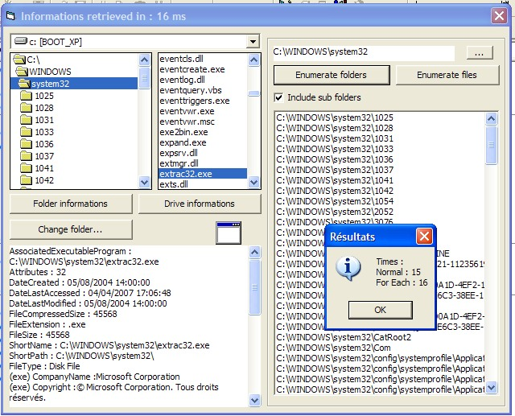



## FileSystemLibrary \(complete replacement for FSO\)

### Description

This code is a COMPLETE library of functions which allows to recover more informations about files/folders/disks (logical and physical) and faster than FileSystemObject.

It replaces totally FSO as it is faster, more complete and easy to use.

There is about 100 functions and 80 properties availables.

Thanks for your comments, and sorry for my bad english (I'm french ^^)

If you have ANY IDEA to improve performances of this classes, please post a comment ! Thanks.

----

UPDATE1 : Fixed some bugs, added lots of new functions (file/disk sanitization DOD 5220.22-M, files comparison, creation of ISO files from a drive, possibility to change file/folder dates, possibility to cut files into parts etc.)

----

UPDATE2: Fixed some bugs, added new functions (file/folder search with different criteria etc.)

----

UPDATE3: Fixed a bug
 
### More Info
 

             |
---                |---
**Submitted On**   |2007-04-29 19:45:58
**By**             |[violent\_ken](https://github.com/Planet-Source-Code/PSCIndex/blob/master/ByAuthor/violent-ken.md)
**Level**          |Advanced
**User Rating**    |4.9 (64 globes from 13 users)
**Compatibility**  |VB 6\.0
**Category**       |[Files/ File Controls/ Input/ Output](https://github.com/Planet-Source-Code/PSCIndex/blob/master/ByCategory/files-file-controls-input-output__1-3.md)
**World**          |[Visual Basic](https://github.com/Planet-Source-Code/PSCIndex/blob/master/ByWorld/visual-basic.md)
**Archive File**   |[FileSystem206395542007\.zip](https://github.com/Planet-Source-Code/violent-ken-filesystemlibrary-complete-replacement-for-fso__1-68436/archive/master.zip)

